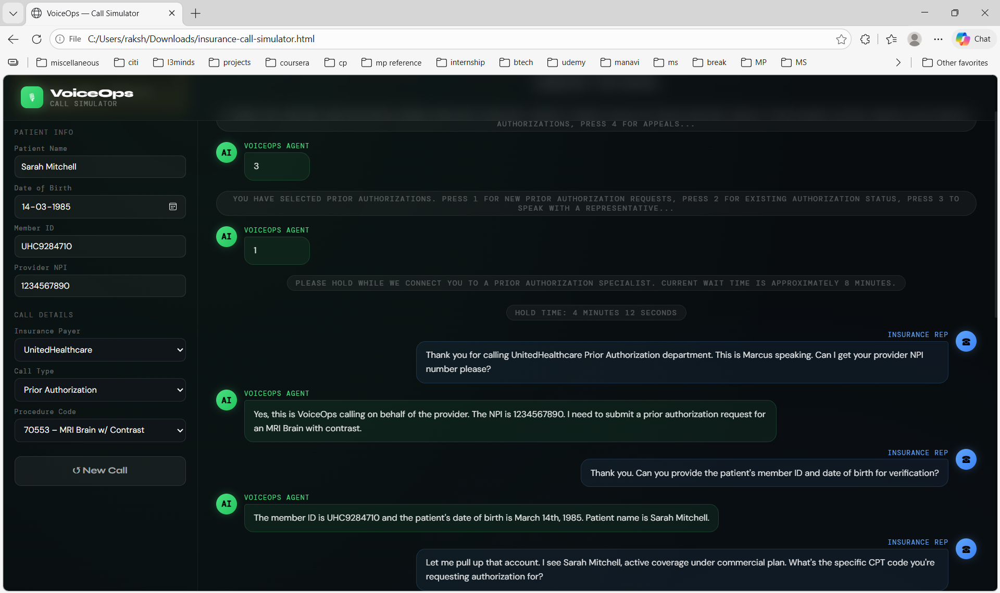

# VoiceOps — Insurance Call Simulator

A single-file, browser-based AI tool that simulates realistic healthcare Revenue Cycle Management (RCM) phone calls between an AI voice agent and an insurance company representative. Powered by the Anthropic Claude API (claude-sonnet-4).



---

## Features

- **Three call types** — Eligibility & Benefits Verification, Prior Authorization, and Claim Follow-Up
- **10 major payers** — UnitedHealthcare, Aetna, Cigna, Humana, BlueCross BlueShield, Anthem, Centene, Molina Healthcare, WellCare, Kaiser Permanente
- **Realistic IVR simulation** — System messages for hold times and IVR navigation are streamed inline with the transcript
- **Live call timer** — Animated LIVE badge counts call duration in real time
- **Animated transcript** — Turn-by-turn dialogue streams with typing indicators between each exchange
- **AI-generated call summary** — Auto-structured outcome card (SUCCESS / DENIED / PENDING) with key fields (deductible, copay, auth status, rep name, etc.) and recommended next steps
- **Zero dependencies** — Pure HTML, CSS, and vanilla JavaScript; no build step, no package manager
- **API key stays in-browser** — The Anthropic API key is never sent anywhere except directly to `api.anthropic.com`

---

## Getting Started

### Prerequisites

- A modern web browser (Chrome, Firefox, Safari, Edge)
- An [Anthropic API key](https://console.anthropic.com)

### Running locally

```bash
# Clone the repo
git clone https://github.com/YOUR_USERNAME/voiceops-call-simulator.git
cd voiceops-call-simulator

# Open directly in your browser — no server needed
open insurance-call-simulator.html
```

Or simply double-click `insurance-call-simulator.html` in your file manager.

### Deploying (optional)

Because this is a single static HTML file you can host it anywhere:

| Platform | Command / Method |
|---|---|
| **GitHub Pages** | Push to `main`, enable Pages → `/ (root)` |
| **Netlify** | Drag-and-drop the file into the Netlify dashboard |
| **Vercel** | `vercel --prod` from the project directory |
| **Any static host** | Upload `insurance-call-simulator.html` as `index.html` |

---

## Usage

1. Open the file in your browser.
2. Paste your Anthropic API key into the **API Key** field (it is stored only in memory for the session).
3. Fill in **Patient Info** — name, date of birth, member ID, and provider NPI.
4. Select the **Insurance Payer**, **Call Type**, and **Procedure Code**.
5. If the call type is *Claim Follow-Up*, an optional claim number field will appear.
6. Click **▶ Simulate Call** and watch the transcript stream in real time.
7. After the call completes, review the **Call Summary** card for outcomes and next steps.
8. Click **↺ New Call** to reset and run another simulation.

---

## Project Structure

```
voiceops-call-simulator/
├── insurance-call-simulator.html   # Entire application — HTML + CSS + JS
├── README.md
├── .gitignore
└── screenshot.png                  # (optional) UI preview for README
```

All application logic lives in a single file:

| Section | Lines | Description |
|---|---|---|
| `<style>` | 1–203 | Dark-theme UI, animations, layout |
| HTML markup | 204–296 | Header, left config panel, right transcript panel |
| `<script>` | 298–521 | State management, Claude API call, transcript streaming, summary rendering |

---

## How It Works

1. The user fills in patient and call details in the left panel.
2. On **Simulate Call**, the app constructs a detailed prompt describing the call scenario and sends it to `POST https://api.anthropic.com/v1/messages` using `claude-sonnet-4-20250514`.
3. Claude returns a structured JSON object containing a `transcript` array and a `summary` object.
4. The app iterates over the transcript array, rendering SYSTEM lines as pill badges and AGENT/REP lines as chat bubbles with animated typing indicators between turns.
5. Once all lines are rendered, the summary card is appended with the outcome badge and extracted fields.

### Prompt structure

```
Transcript entries use three speaker values:
  SYSTEM  → IVR prompts, hold music notices, connection events
  AGENT   → VoiceOps AI agent dialogue
  REP     → Insurance representative dialogue

Summary fields returned:
  outcome      → SUCCESS | DENIED | PENDING
  fields[]     → label/value pairs (coverage, deductible, copay, auth, duration, rep)
  nextSteps    → Plain-text recommended action
```

---

## Configuration

All configurable values are in the HTML form. To add payers or procedure codes, edit the `<select>` elements:

```html
<!-- Add a payer -->
<select id="payer">
  <option>UnitedHealthcare</option>
  <option>Your New Payer</option>   <!-- ← add here -->
</select>

<!-- Add a procedure code -->
<select id="procedure">
  <option>99213 – Office Visit</option>
  <option>XXXXX – Your Procedure</option>   <!-- ← add here -->
</select>
```

To change the Claude model or max token budget, update the `fetch` body in `startSim()`:

```javascript
body: JSON.stringify({
  model: 'claude-sonnet-4-20250514',   // swap model here
  max_tokens: 1500,                     // increase for longer transcripts
  ...
})
```

---

## Security Notes

- **API key is never persisted.** It lives only in the DOM `<input>` element for the duration of the browser session.
- **Direct browser API access** is enabled via the `anthropic-dangerous-direct-browser-access: true` header, which is required for client-side calls. This is appropriate for local/demo use. For production deployments, proxy the API call through your own backend so the key is never exposed client-side.
- This tool does not transmit any patient data to third parties. All data goes directly from your browser to `api.anthropic.com` and is not stored.

---

## Contributing

1. Fork the repo
2. Create a feature branch: `git checkout -b feature/my-feature`
3. Commit your changes: `git commit -m "feat: add my feature"`
4. Push: `git push origin feature/my-feature`
5. Open a Pull Request

Please keep all logic in the single HTML file to preserve the zero-dependency design.

---

## License

MIT © Your Name

---

## Acknowledgements

- Built with the [Anthropic Claude API](https://docs.anthropic.com)
- Fonts: [DM Sans](https://fonts.google.com/specimen/DM+Sans), [DM Mono](https://fonts.google.com/specimen/DM+Mono), [Syne](https://fonts.google.com/specimen/Syne) via Google Fonts
